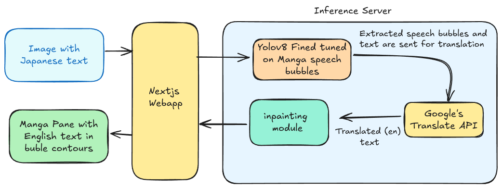
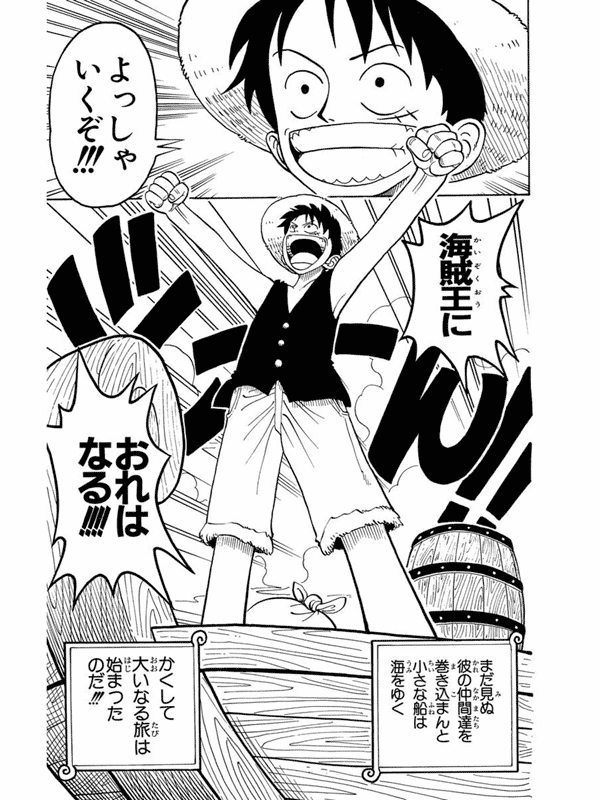
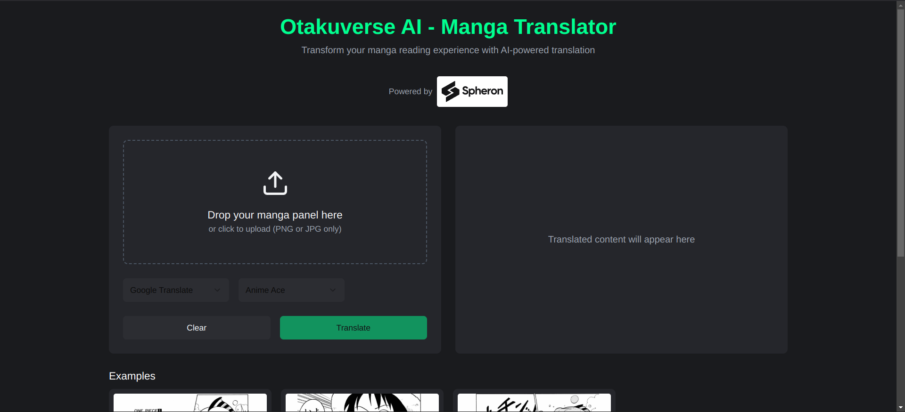

On finding out about the Spheron Network's bounty challenge, I decided to find out what I can do among the challenges - https://github.com/spheronFdn/sos-ai-bounty.

Since I am into Anime, the manga translator task caught my eye.

I had no idea how to do it, but I decided I would figure it out on the go.

## The rough plan

The plan was to approach the problem as a human being. What would I do as a human to get the English version?

- I would look out for the speech bubbles in the text.
- Get the text and mark the locations or the speech bubbles they belong to.
- Translate each of the texts.
- Put it back in the right bubbles after removing the Japanese one.

## Getting those speech bubbles...

If you don't know what a Manga is, here is one of the manga panels of One Piece: 

You will notice that most of the text is inside the blobs called speech bubbles. 

So first, I needed a way to extract the speech bubbles out of the manga art.

This did sound like a vision challenge. Also, I was influenced by the fact that I had finished a similar surveillance project with my teammates for a college course. There, I barely did any of the ML part as it was handled by a professional.

Here's the project for the curious - https://github.com/TheUndercover01/Multi-Camera-person-tracking-NITK

So, I decided I would be using a similar approach of detecting speech bubbles instead of jaywalkers. For this, I would need some kind of manga image dataset... hmmmm, got it! 

Dataset - https://universe.roboflow.com/luciano-bastos-nunes/mangas-bubble

## Training the model...

The model which is most commonly used for detection tasks is YOLO. It is good for general-purpose detection, but for my task, it was not particularly effective. It would have been a great relief otherwise. 

####  Enter fine-tuning:

Fine-tuning the model meant that we have to train the model on specific data, which in our case is the manga speech dataset. This will enable the model to detect the speech bubbles better.

The training environment was rather unconventional as it was trained on a decentralized network of GPU compute where you can freely rent any type of compute. 

## The translation...

Converting the text to English is pretty straightforward. I just used the `deep-translator` package from Google to translate the Japanese.

## In-painting...

In-painting is the process of filling up the missing parts of an image. There are many ways to go about this process, including the use of LaMa: Resolution-robust Large Mask Inpainting with Fourier Convolutions, which can give you pretty good results. 

For my fun little project though, I thought of going simpler using some Python `cv` package.

The text placement process begins by preparing the image to accept text overlays and measuring the speech bubble's dimensions to determine space constraints. 

Starting with default text settings for size, spacing, and wrapping, the system automatically scales down these properties if the content exceeds the available bubble space. 

Finally, it centers the adjusted text within the bubble boundaries, ensuring translated text fits naturally within speech bubbles of any size.

## Finally, the web app

I quickly built a web app that talks to the inference server by sending in the image and getting back the translated manga image.

This concludes the project and it would not have been possible without the immense research that goes into building these kind of models and people who make them easy to use.

Lastly, I would encourage you to look into the bounties as they have a pretty good prize pool for other tasks. 

