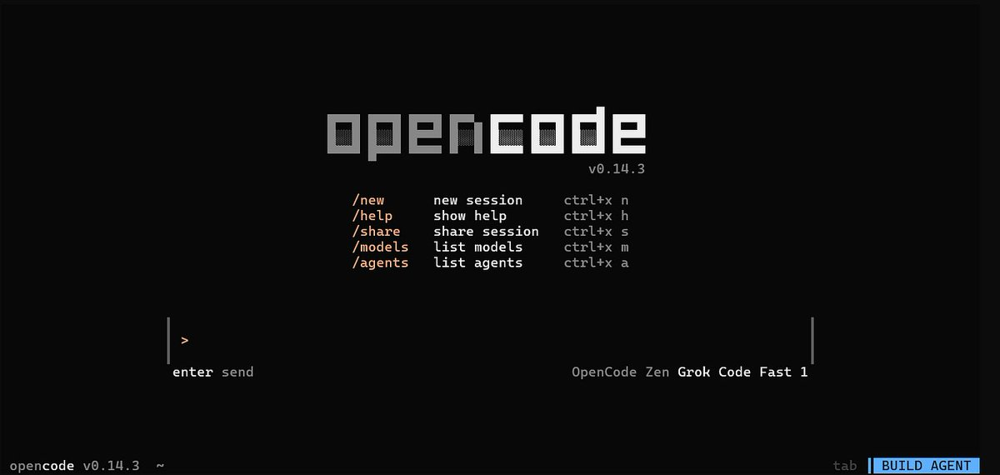
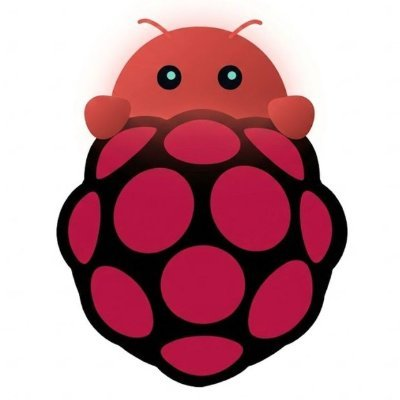

For the last few months, I have been running a background coding agent built using OpenCode on a VPS.

I was inspired by [Ramp Inspect](https://builders.ramp.com/post/why-we-built-our-background-agent) and other implementations and wanted to see how far I can push it.

I started with a tall order for the agent to be useful and worth investing my time in.

## What I want the agent to do

I want the coding agent to handle the following tasks (almost) autonomously:

- Fix minor issues like formatting, creating a new REST API endpoint, creating a new page, etc.
- Build the project, update dependencies, and fix any errors that come up
- Deploy to the given instance
- Build n8n workflows and test whether they are correct or not
- Inform me when the work is done
- Has access to all my GitHub repos and is easy to deploy on a VPS
- Use a browser to check the output visually and fix any issues

## The litmus test

What would make this agent actually useful to me? It needs to be able to:

- Add a new blog post to my personal site
- Create a non-trivial automation workflow without my help
- Add a new feature like CLI enhancements to a complex Golang project
- Add features to itself

## Enter OpenCode



OpenCode is a really great agent. It exposes an HTTP interface and you can spawn as many instances as you want. But managing multiple sessions and projects was getting complex, so I built a small script used for high-level project management.

## Caddy setup

In order to expose multiple projects on custom subdomains, I decided to use a proxy server. I started with nginx but didn't like the setup. Then I found Caddy — really simple and straightforward.

Here's a sample config that reverse-proxies to OpenCode instances running on different ports for better isolation:

```
*.example.com {
    tls {
        dns digitalocean {env.DO_AUTH_TOKEN}
    }

    @app1 host app1.example.com
    handle @app1 {
        reverse_proxy localhost:4096
    }

    @app2 host app2.example.com
    handle @app2 {
        reverse_proxy localhost:4097
    }

    handle {
        abort
    }
}
```

## Tools

In the default setup, OpenCode can only make changes locally on the server. But I wanted it to use the same tools I have access to as a dev. So I set up:

- `gh` (GitHub CLI)
- n8n skills and MCP
- `browser-use`
- `ffmpeg`
- `docker`
- `gws` (Google Workspace CLI)
- `gemini-cli` (for image gen via Nano Banana)

## Using OpenClaw as an orchestrator



I gave this setup to BerryClaw — my personal OpenClaw instance running on a Raspberry Pi — and used it to manage multiple projects.

## Results

BerryClaw, with the help of this background coding agent:

- Created 2 n8n workflows that worked end to end
- Sent 3 minor PRs to my personal sites
- Wrote 2 blog posts (I gave it the rough content)

I'll keep improving this agent, but I'm happy with where it is now.

## References

- [background-agents by ColeMurray](http://github.com/ColeMurray/background-agents)
- [Why we built our background agent — Ramp](https://builders.ramp.com/post/why-we-built-our-background-agent)
- [Minions: Stripe's one-shot end-to-end coding agents](https://stripe.dev/blog/minions-stripes-one-shot-end-to-end-coding-agents)
