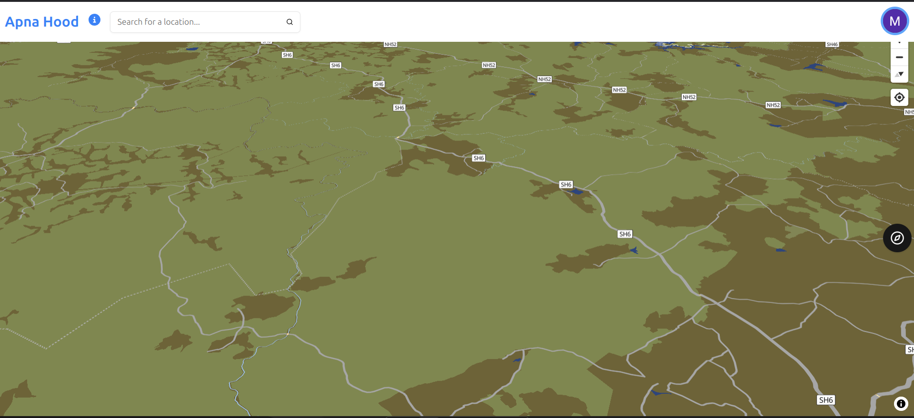
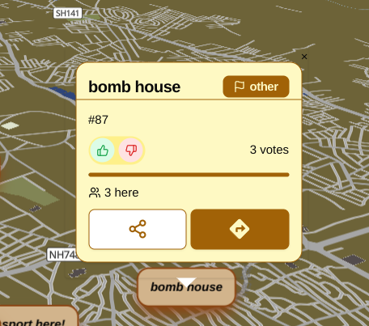
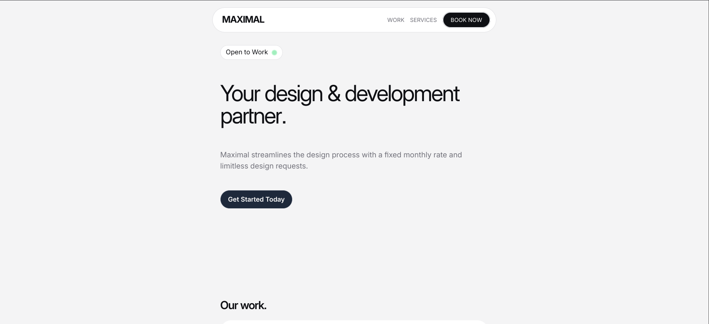
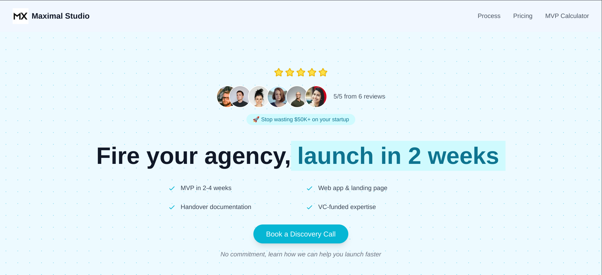

I am back with few updates on the projects I am working on. 

TL;DR

- ApnaHood UI enhancements
- Maximal Studio website re-design
## 1. ApnaHood

Just to introduce it to the new readers, ApnaHood is a map based experience with the exact purpose yet to be finalized. You can check it out at https://apnahood.maximalstudio.in/

#### Map Style Update

In the recent updates, we have updated the UI by quite a bit. We now have a adventure map style and color scheme - 

Apart from these, we are working on the quests board that will show users interesting challenges from various places. This is still a work in progress, so stay tuned for the next edition.

#### Popup has new features

Now you can click on a message and see how popular a place is, based on the votes, how many people have been there, etc. 

You also have the option to show directions to that pin, which opens up in a Google Maps instance. 

The UI of the Popup is made to match the overall map style. The share button is currently non-functional, which when implemented, will give you the option to share the pin to someone.

Minor fixes include, fixing Authentication code exchange for PKCE OAuth flow, removal of unimplemented features like the leaderboard (coming soon), responsiveness improvements. 

## 2. Maximal Studio Website Re-design 

If you don't know, I run a web development agency for building software of any kind. You can check it out here - https://www.maximalstudio.in/

The old agency website was a clone of a agency website template provided by a popular themes library - [Lexington Themes](https://lexingtonthemes.com/). 

We tried to use it as a starting point since the idea was to sell websites to local businesses. But now we are pivoting to making MVPs for people who want to go to market as quickly as possible. 

To fit this theme we have changed our UI from this 

to this

I hope to find more clients using this site. If you want a website or a software to build quickly, then contact us through the website.

That's it for this devlog. See you in the next edition!!