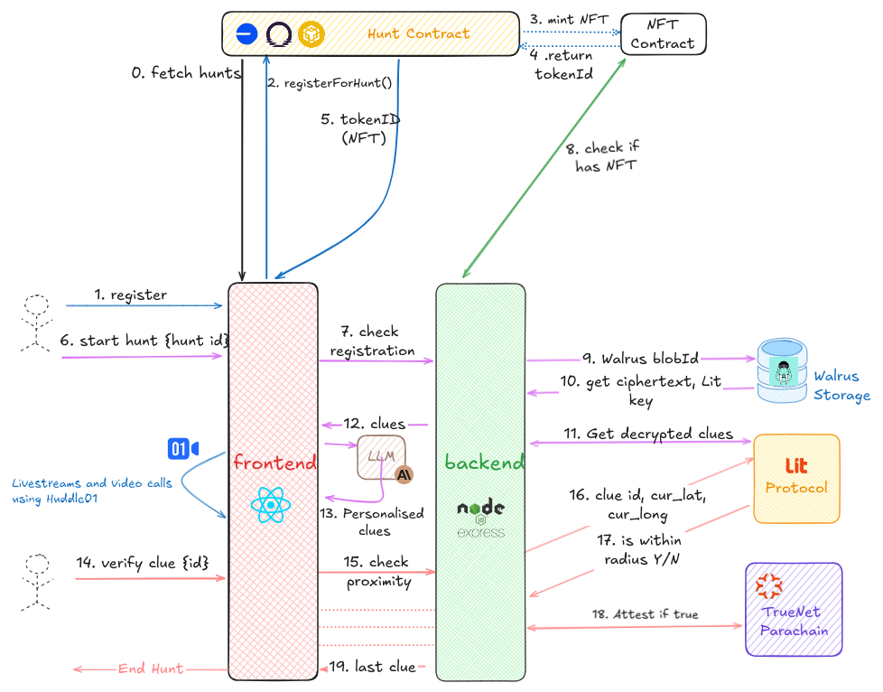
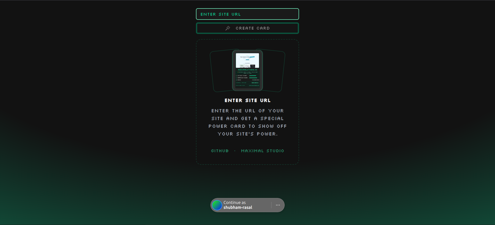

I am back after a long time and this time it's different.

TL;DR

- Almost got our first client for Maximal Studio
- My team's project won bounties @ETHIndia 24
- Built an exciting new project that got 2000 visitors
- Another project that won me a bounty

## 1. Maximal Studio and the new client

My friend whom I run the agency with got a lead referral form one of his friend. But it was not that simple. 

The thing was, they wanted to do social media marketing (paid) and we don't specialise in that. Nevertheless, we did not say no to the client and are in the process of closing the deal.

We also shot an ad for our agency. Follow to get to see the video and BTS.

## 2. ETHIndia 2024

It was fun hacking at this year's ETHIndia as a team with some of my seniors. 

We built Khoj (meaning 'search' or 'discovery' in Hindi), a gamified geo-location based treasure hunt platform that combines real-world exploration with Web3 technology. 

Khoj transforms traditional scavenger hunts into an immersive blockchain experience with a dream to bring millions of new users to the Web3 world.

The technical details about the project can be found in the repo [here](https://github.com/marcdhi/Khoj) and the demo of the project can be found on Youtube - [https://youtu.be/9JETJmd9TOk](https://youtu.be/9JETJmd9TOk)

## 3. Cardify

As part of our tool marketing strategy for Maximal Studio, I made a fun little website that can turn your website into a card.

I was pretty happy with the result as the site got around 2000 visitors on the day of the launch. 

## 4. Otakuverse - AI Manga Translator

I built a site that can translate any Japanese manga image into an English one. 

This was built using Spheron Network of compute for training (https://spheron.network).

I will explain how I did it in another blog post soon.

This was a wrap-up of all the things I did recently. See you in the next edition!!