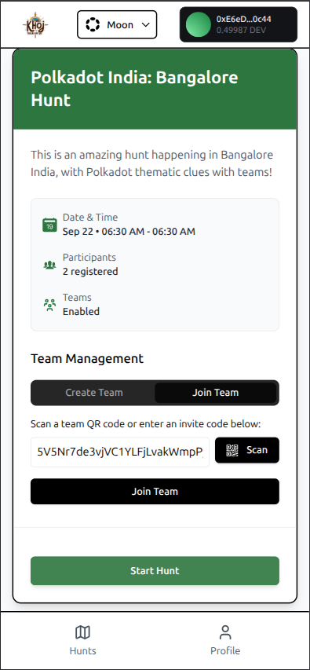
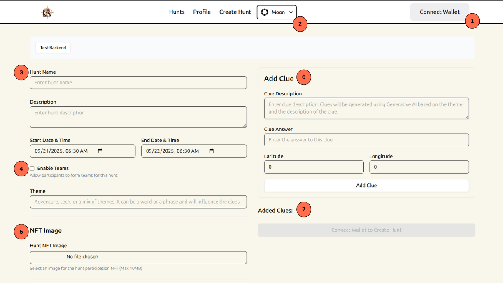
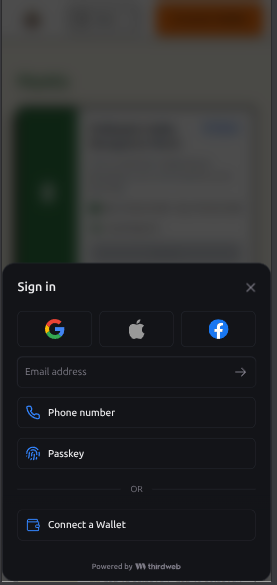

Khoj is our platform for **AI-powered, location-based treasure hunts**.

Players solve riddles, visit physical locations, and earn onchain rewards. Each user receives a unique NFT upon registration, and completing hunts grants rewards recorded on-chain.  

Since our MVP at **ETHIndia '24**, we’ve significantly improved usability, stability, and the overall experience.  

This milestone focuses on making Khoj more robust, secure, and fun — while staying true to our mission of building a **Web2-native experience that seamlessly onboards users to Web3**.


## 🚀 Major Updates

### 1. Accurate Distance Algorithm
- Replaced the earlier naive distance logic with the `haversineDistance` algorithm for precise geolocation checks.
- Reduces error margins for location validation, with a **sub-10m accuracy**, ensuring fairer gameplay.
- We also noticed that mobile phone browsers use the native GPS sensor. This leads to better user location coordinates. Since, Khoj is mobile-first, coordinates received from phones with precise location turned on, lead to much better results.

- [PR #36](https://github.com/ayush4345/Khoj/pull/36)  

---

### 2. On-chain Hunt Winners
- Winners are now tracked **on-chain**, and are finalised when a hunt ends.
- [PR #37](https://github.com/ayush4345/Khoj/pull/37)

---
### 3. Teams: Secure, Decentralized, and User-Friendly

One of the most requested features during our pilot hunts was **support for teams**. Designing this was far from trivial:  

The original Khoj design assumed solo-only hunts.We needed a way to let users **form teams securely**, without central storage, and without exposing sensitive invite codes on-chain.The final flow had to balance **security, decentralization, and user experience**.

After several iterations, here’s the final architecture we built:

---

#### 🔐 Smart Contract Responsibilities
The smart contract is the **source of truth** for teams.  
It handles creation, membership checks, and validation when new members join.  

```solidity
struct Team {
    address owner;
    uint256 maxMembers;
    uint256 memberCount;
    mapping(address => bool) members;
}

mapping(uint256 => Team) public teams;
uint256 public nextTeamId;
```

- **Create Team:**  
    `createTeam(maxMembers)` → creates a new team, sets the owner, and stores maximum size.
    
- **Join via Invite:**  
    `joinWithInvite(teamId, expiry, signature)` → verifies the invite signature and admits new members.

Validation checks:

1. Invite not expired (`block.timestamp <= expiry`).
2. User not already in current team or any other team for the given hunt.
3. Team not full (`memberCount < maxMembers`).
4. Signature must match the team owner:
    - Hash: `keccak256("TeamInvite", teamId, expiry, chainId, address(this))`
    - Verified via `ecrecover()`.

This ensures only legitimate invites signed by the team owner are accepted.

---

#### 📱 Frontend Responsibilities

The frontend handles **user interaction, invite generation, and QR code management**, all without relying on a centralized backend.

##### A. Registration

- User connects with **ThirdWeb wallet** (can be Web3 wallet or Google/social login).
- Reads contract state:
    - If not in a team → show **Create Team** / **Join via Invite** options.
    - If already in a team → show team details.

##### B. Create Team

- User sets max team size.
- Calls `createTeam(maxMembers)` on-chain.
- Contract returns `teamId`.

##### C. Generate Invite (Multi-use, Ephemeral)

- Owner chooses expiry (e.g., hunt_start + 1hr).
- Frontend generates:
    - `inviteHash = keccak256("TeamInvite", teamId, expiry, chainId, contractAddress)`
- Signs the hash using `wallet.signMessage()` via ThirdWeb.
- Bundles `{teamId, expiry, signature}`.
- Encodes into **Base58** (shorter than hex → better QR).
- Generates a **QR code** or short code.

⚠️ Invite is shown **once only** — never stored by backend or on-chain.

##### D. Join Team

- User scans QR or pastes invite string.
- Frontend decodes `{teamId, expiry, signature}`.
- Calls `joinWithInvite(teamId, expiry, signature)` on-chain.
- Contract validates and admits user if rules are satisfied.

👉 Detailed implementation: [PR #59](https://github.com/ayush4345/Khoj/pull/59)




---

### 4. LLM Upgrade: Claude → Gemini Flash

- Migrated clue generation from Claude to **Gemini Flash**.
- Benefits:  
  - Structured outputs, easier parsing.  
  - Reduced prompt-to-clue parsing errors.  
  - More robust and consistent gameplay experience.  
- [PR link](https://github.com/ayush4345/Khoj/pull/51)

---

### 5. Custom NFT Images for Hunts

- Hunt creators can now upload **custom images**.  
- Earlier, all hunts used the same default NFT art.  
- Each hunt’s NFT is minted via a **the main Khoj contract**, making experiences more personalized. 

---

### 6. Hunt Creation UI

- A **full UI for hunt creation** now replaces the Remix IDE workflow.  
- Creators can configure all parameters:  
  - Hunt name, description, timeline  
  - Teams toggle + max team size  
  - Custom NFT image  
  - Clues (encrypted via Lit + uploaded to IPFS)  
- Smooth wallet integration powered by **ThirdWeb**.  



---

### 7. Wallet & Onboarding

- Integrated **ThirdWeb wallet**, allowing both **Web3 wallets and Web2 social login (Google, etc.)**.  This significantly improves the user experience of our target audience.
- This aligns with our focus on **Web2-native UX → Web3 rewards**.



---

### 8. Lit Protocol + IPFS Migration

- Moved encrypted clue  storage from Walrus to **Lit Protocol + IPFS (Pinata)**.
- Challenges solved:  
  - Data passing issues between contract, Lit, and IPFS.  
  - Handling retries for failed uploads.  
  - Eliminated hardcoded logic in clue validation and encryption.  

Note: Lit seems to have a lot of reliability issues and we are considering migrating from the service and explore alternatives.

---

### 9. Backend Stability & Testing

- Built an **extensive test suite** for smart contracts to handle edge cases and prevent regressions.  
- Added retry mechanisms for clue verification & clue decryption.  
- Cleaned up legacy code → removed hardcoded values across flow.  
- Backend deployed on **OCI**, frontend on **Netlify**, making Khoj fully live and testable.  

Live link: [khoj-alpha.netlify.app](https://khoj-app.netlify.app/)  

---

### 10. Miscellaneous Improvements

We also pushed several smaller but important updates:
- Environment variable cleanup (safer, more configurable deployments).  
- Improved error handling and UX flow for retries.  
- Added product guide for easier onboarding.  
- Removed unnecessary logic that caused fragility.  

---

## 📖 Product Guide
We’ve also added a **full product guide** with screenshots and step-by-step instructions:  

👉 [Read it here](https://github.com/ayush4345/Khoj/wiki/Product-Guide)  

Covers:  
- Hunt creation  
- Registering & exploring hunts  
- Team creation & joining flow  
- Solving clues  
- Rewards  

---

## 🧭 Next Steps
- Run more **pilot hunts** to refine user experience.  
- Expand testing to edge cases.  
- Improve offline → on-chain **reward distribution logic**.  
- Continue focusing on **frictionless onboarding** while keeping the underlying infra secure and decentralized.

We are also actively working on the landing page and other aspects of the product to make it the best in class.

---
- Live app: [Khoj Alpha](https://khoj-alpha.netlify.app/)  
## 🔗 Resources
- Live app: [Khoj Alpha](https://khoj-app.netlify.app/)  
- GitHub repo: [Khoj](https://github.com/ayush4345/Khoj)     

---

That’s the progress so far 🚀.  
If you’d like to try Khoj or give feedback, hop into a hunt and let us know your thoughts!  
