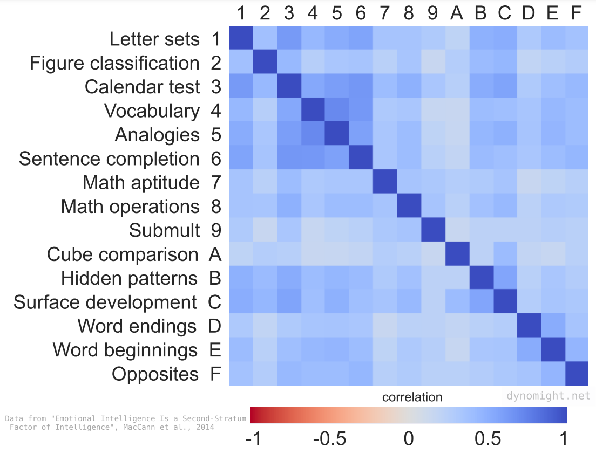

Disclaimer - heavily inspired by [Suchir Balaji’s View](https://docs.google.com/document/d/1ItRqrpgQHJ05rQx0zc26t1_NgpUcw3znwTWpXxqH8uI/edit?tab=t.0) and other recent papers. Also, this blog post is not very structured.

## What is intelligence really?

Suchir defines intelligence as the rate at which you learn a capability from data points. An intelligent being will learn it faster than an unintelligent being. 

This definition is important because a machine trained on loads of data might be superhuman on a given task, but the generalization would be absent.
  
These gaps of understanding between various specialized tasks can’t be filled with RL or scale. This means RLHF or a billion GPUs won’t get us to GPT-11, for example.

## Generalization

Generalization is data efficiency. The idea is to capture all the possible causations and correlations among the data points by connecting all the dots.

How to get the models to generalize?

First, though, we need to confirm whether general intelligence is real or not.
 

  
  Let’s define the characteristics of an architecture that will be able to acquire general intelligence. For this, we can take inspiration from our own brain -

- We have the mammalian brain that is trained over millions of years with basic instincts
- The neocortex makes us humans special and adaptive to the changing world (this is the reason why we spend a significant time of development outside the womb)

One requirement is obvious - it should be data efficient from the start. This is so that it can form a large number of internal models about that world.

The second requirement would be to have the ability to reuse neurons for multiple recurrent computations that are distinct. This also ensures the data efficiency of our brain

Due to my limited knowledge of the field, I am not sure if the reusable part is true or not. Need to fact-check.

## What are we trying to make?
  
One interesting fact Suchir mentions is, people try to draw similarities between the genome and the trained LLM. This is not really true. The genome is much closer to the LLM codebase than it is to the actual trained LLM.
  
This is because evolution can’t use the genome to store the words or situations encountered by the ancestor organisms due to the simple fact of keeping the genome short.  
  
This means that the shortness of the genome is an important condition for generalization.

## AGI

What Open AI is trying to do to achieve AGI is to scale test time computing. This might work in the short term. But it doesn’t solve the generalization problem.

Another problem with building AGI with current approaches, such as scaling NNs, is that the brain is a complex neural network that can learn when data is applied to it.

What we want is not to replicate the brain (which can be considered proof of concept for the idea that AGI exists) but to develop a simpler model of evolution that actually learned the “meta-skill” of producing the brain when tasks across a diverse environment were applied to it.

RL is also not that useful to achieve our goal which is to optimize the objective itself.

Let’s take an example. Consider you have to make an agent solve a maze. 
 

  

The loss function you might consider would be |x_agent - x_end|. Now, what if the agent gets stuck in a corner? No amount of exploration would help you. Nor will the size of the NN control the agent.

This is because in pathfinding, exploration is the problem we are trying to solve. 

We could, as programmers, add heuristics and backtracking, but the point is to see whether the agent can come up with it.

## Newer model architectures 

Recently, there might be some hope - [https://arxiv.org/abs/2501.00663](https://arxiv.org/abs/2501.00663)

The core idea of the paper is to model learning at test time by introducing neural memory modules. These structures aim to emulate human memory.

The limitation of transformers is the quadratic dependency on data due to the attention mechanism. The RNNs don’t have that issue as they are linearly dependent. The researchers replace the fixed size vector used as a hidden state in an RNN with a NN that is trained during test time.

The most interesting thing in the paper was how they modeled surprise -  

  

This approach simulates the long-term and short-term memory of humans. As a result, it performed much better on the needle-in-the-haystack benchmarks.

But does this fit our criteria for intelligence?

Before we go into that, let's explore another idea discussed in this paper - [https://www.arxiv.org/pdf/2410.02536](https://www.arxiv.org/pdf/2410.02536)

The main takeaway of the paper is that certain rules that are used to generate synthetic data are much more likely to improve the model's logical reasoning capabilities than others. Does this sound familiar?

This can be compared with the genome example we discussed earlier where the actual intelligence is derived from a complex adaptive meta-learning process called evolution. If you look at the rules in the paper, you can see that they are pretty simple, something like Conway’s game of life.

The researchers also tried to check whether the model has learned about these simple rules from the dataset. It did not. It did have a dependence on the pattern generated by the rules which affected it’s attention mechanism, but not the rules.

We do have different forms of reasoning - intuitive, logical, though, inductive, causal, search.
These are not fixed. For example, Ramanujan had a goddess-based reasoning that helped him get answers to some complex mathematical puzzles. 

This means that whatever mechanism we develop, it should not just memorize the simple rules it is trained on. The edge of chaos approach therefore seems promising for the future of reasoning.
