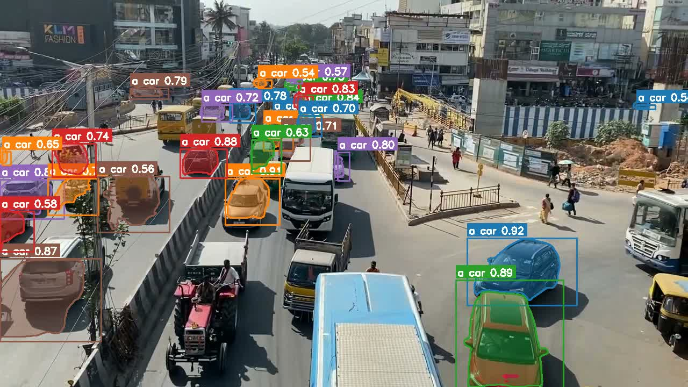
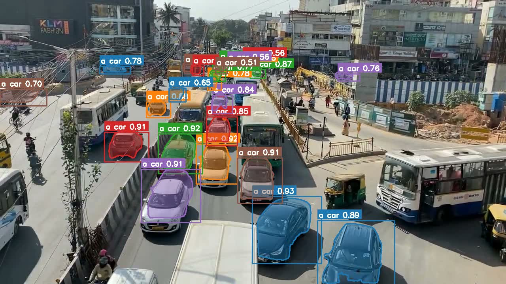
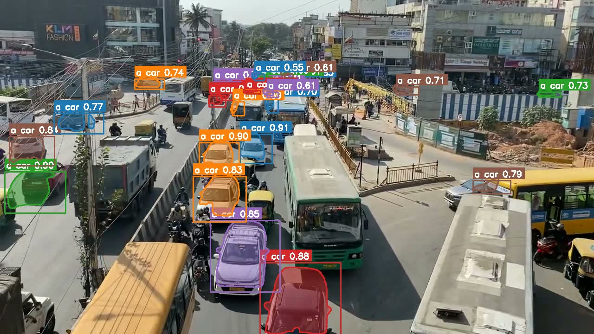
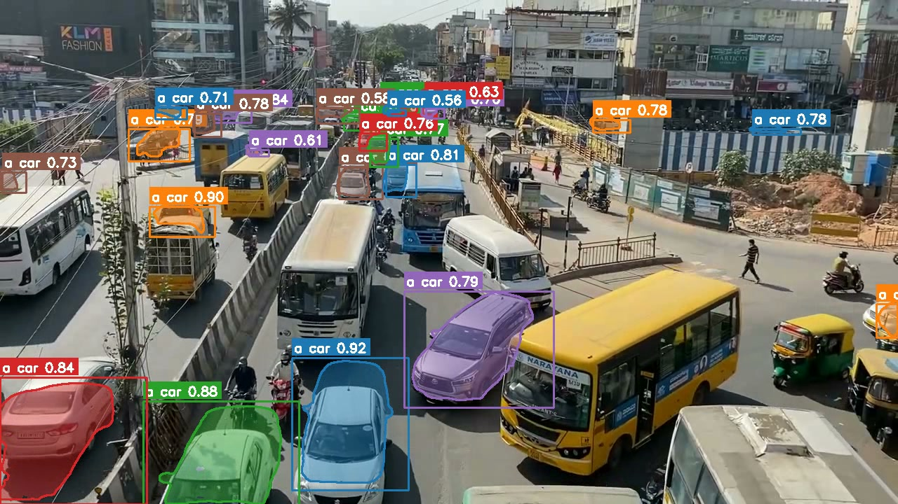
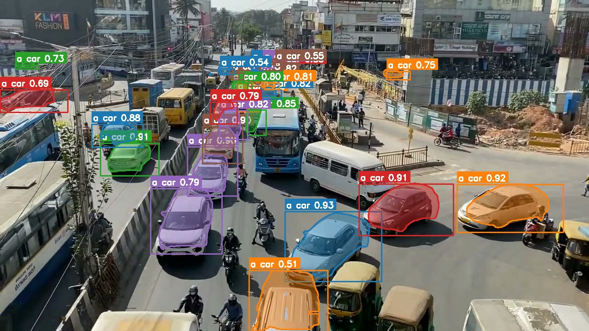

*Notes from running Meta’s Segment Anything 3.1 on Apple Silicon via MLX*

While experimenting with **SAM 3.1** (Segment Anything Model 3.1) on local hardware, I hit a moment that felt less like “running a model” and more like **having an operator I could steer in English**. I pointed it at dashcam footage of a busy highway interchange and asked—not for a caption—for a **directional vehicle count**. The stack answered. The numbers matched what I could verify by eye.



If you had to build **traffic flow analytics or layer-aware compositing** from raw video, how would you do it?

One workable answer today is: *treat segmentation + tracking as the primitive*, and push semantics (left vs. right, foreground vs. background) into a thin layer of code on top.

---

## Mental Model: Classification vs. Operator

Most people’s picture of “vision AI” is **classification**: image in, label out. That was remarkable in 2012; in 2026 it is baseline.

SAM 3.1 is doing something closer to **instance geometry**:

* You specify what you care about in **natural language**
* The model returns **masks**—exact outlines—not just categories
* Those masks **persist across frames** as tracks (IDs, colors, continuity)

So the useful abstraction is not “what is this frame *about*?” but “**which pixels belong to which object over time?**”

```
Traditional mental model          SAM 3.1 mental model
        |                                  |
   Photo → Label                    Video + Prompt → Masks + Tracks
        |                                  |
   "car" (one tag)                 Car₁, Car₂, … Carₙ per frame
                                         |
                                  Stable IDs across time
```

---

## What the Stack Optimizes For (Locally)

The runs I care about here are **offline-friendly** and **privacy-preserving**:

* **No cloud** — weights and inference on the machine
* **No API round-trips** — latency is compute-bound, not network-bound
* **Plain-English prompts** — the interface is language, not hand-tuned CV pipelines

Concretely: **mlx-community/sam3.1-bf16** on **MLX**, **873M parameters**, on **Apple Silicon**.

---

## Experiment 1 — Highway: From Masks to a Directed Count

**Input:** ~53 seconds of 720p overpass footage.  
**Prompt:** `"a car"`.



**Observation:** Per-frame instance counts bounced in a band (roughly **19–28 vehicles**), which is expected—occlusion, merge/split, and frame boundaries are hard. What mattered more was **track continuity**: each vehicle kept an ID, mask, and trajectory long enough to reason about **dominant side of frame / road**.



I wrote a small post-processing step: from track geometry, classify which side of a split line each track **spent most of its lifetime** on, then aggregate.

**Result:**

| Direction | Count | Share   |
| --------- | ----- | ------- |
| Left lane | 408   | 70.1%   |
| Right lane| 174   | 29.9%   |



```
Raw frames
    |
    v
SAM 3.1 (prompt: "a car")
    |
    v
Per-frame masks + track IDs
    |
    v
Heuristic: dominant side of split line per track
    |
    v
Directional flow statistics
```



**Takeaway:** the “heavy” part—**find instances and keep them coherent**—is delegated to the model. The “thin” part—**geometry + aggregation**—is ordinary code. That split is the design win.

---

## Experiment 2 — Detection Cadence: Trading Accuracy for Throughput

Default behavior effectively **re-detects every frame**. On **720p** hardware here, that landed near **~0.5 fps**—fine for batch analysis, unusable for interactive loops.

SAM exposes a **`--every N`** knob: full detection every *N* frames, **propagation** in between.

| Detection cadence | Approx. speed (720p) |
| ----------------- | -------------------- |
| Every frame       | ~0.5 fps             |
| Every 5 frames    | ~3.0 fps             |
| Every 15 frames   | ~7.8 fps             |

At **every 15**, the tracker’s interpolation is smooth enough that, for many UIs, the shortcut is invisible—until you freeze-frame and hunt for edge cases.

```
Every frame                    Every N frames
     |                               |
 Full detect each step            Detect ──► Propagate ──► Propagate ──► …
     |                               |
 High fidelity masks              Lower CPU/GPU duty cycle
     |                               |
 ~0.5 fps (here)                   ~7–8 fps (here, N=15)
```

---

## Experiment 3 — Compositing: A Depth List Instead of One Mask

**Goal:** the “text sandwiched between environment and subject” effect (background → text → foreground).

**Naive approach:** segment the person; paste text behind. Works until **desk, mic, bottle, tablet** should also occlude the text—you either fight with rotoscoping or you **enumerate foreground**.

**Better approach:** define a **foreground set**; union masks; composite in three layers.

```python
FOREGROUND_OBJECTS = [
    "a person",
    "a wooden table",
    "a bottle",
    "an iPad",
    "a microphone",
]
```

SAM segments **all prompts in one pass**; the compositor does **background → typography → union(foreground masks)**.

```
Layer stack (bottom → top):

[ Environment pixels ]
        |
        v
[ Text ]
        |
        v
[ Union(person, table, bottle, iPad, mic) ]
```

**Takeaway:** once masks are cheap and prompt-driven, **compositing becomes a configuration problem**, not a hand-drawn matte problem.

---

## The Insight That Actually Generalizes

What stuck is not any single demo. It is that SAM collapses the distance between **intent** (“these things belong in front”) and **machine-manipulable state** (per-pixel ownership over time).

> **Prompt → mask → program.**  
> You stop hand-authoring detectors for every object class; you **name** what matters and operate on the pixels the model hands back.

That is closer to **writing constraints for an operator** than to classic OpenCV plumbing—different skill, different failure modes.

---

## Limits (Honest Accounting)

* **Wall time:** a **53 s** clip at conservative settings was on the order of **~6 minutes** end-to-end here. “Real-time” at **full HD** is still aspirational; **lower resolution** (e.g. **224 px** short side) is where live-ish tracking becomes plausible.
* **Temporal noise:** fast edges **flicker** without smoothing; an **EMA across masks** fixes a lot of it but needs tuning.
* **Semantics:** the model gives you **shapes and categories**, not **causality**. It will not explain *why* the left lane is busier—only that **the pixels were there**.

---

## Where This Goes

The trajectory is unambiguous: **faster silicon**, **better propagation**, **tighter integration with capture pipelines**. Tomorrow’s constraint is less “can it segment?” and more “**what do you ask it to pay attention to?**”

That question is already the interface SAM forces you to answer—**one English prompt at a time**.

---

**End result:** a local, prompt-driven **video operator** that turns “describe what matters” into **masks and tracks** you can feed normal code—counts, dashboards, editors—without standing up a CV lab first.

---

## References

- [mlx-community/sam3.1-bf16](https://huggingface.co/mlx-community/sam3.1-bf16) (weights)
- [MLX](https://github.com/ml-explore/mlx) (Apple Silicon framework)
- Meta’s SAM family (Segment Anything) — see official docs and model cards for capability boundaries
