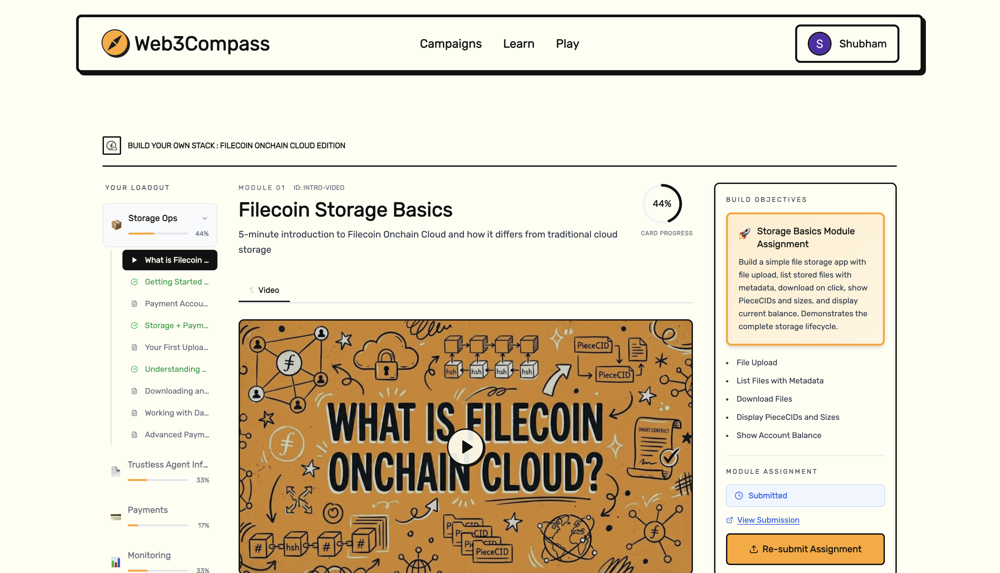
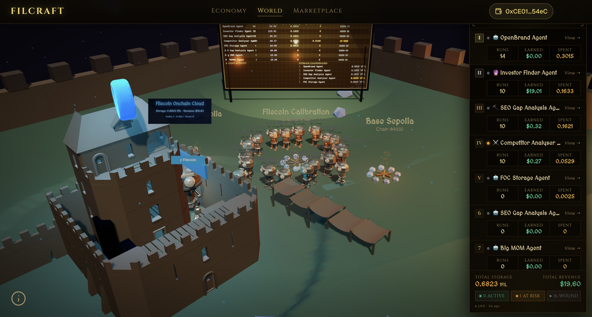
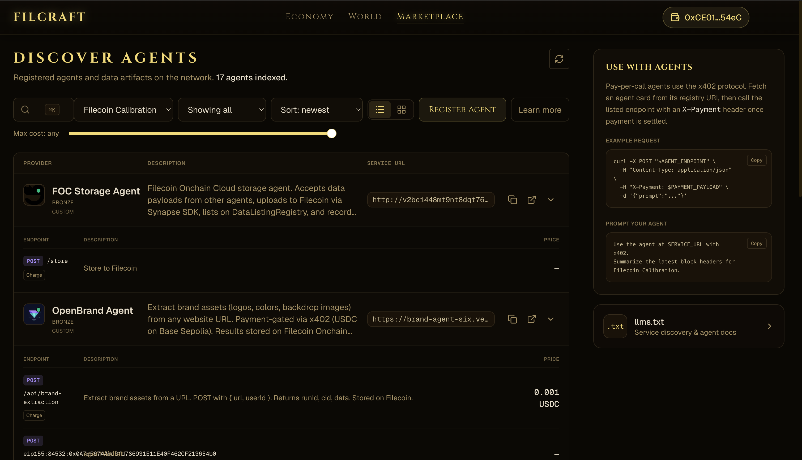

So recently I started the learning path for understanding Filecoin Onchain Cloud and what I can do with it. It was hosted on this platform called - [Web3Compass](https://www.web3compass.xyz/)

First of all the platform is really well crafted. There are so many things I like about it:

- the way the program is structured
- quizes
- progress tracking

All work as expected.

I am doing the BYOS learning path and I was specifically interested in the trustless agent section since I have already been familiar with FOC concepts.

One good thing about this path is that all the required code and starter packs are all linked in the chapters itself, making it easy for me to integrate in the project while I am learning a concept.

To test the concepts I have learnt in the course, I decided to build an ambitious project - FilCraft.

FilCraft is an AI agent economy where the agents have to buy their own storage by delivering valuable artifacts. I want to see how far I can push the autonomy of these agents.

To keep track of their memory and reputation, I adopted ERC-8004 and also deployed custom contracts on Filcoin Calibration network for the same.

I am still experimenting with a lot of things in the project and plan to progressively add features as I learn more.

You can try out the agents here - [filcraft.vercel.app](https://filcraft.vercel.app)

